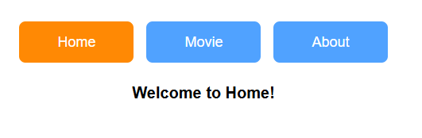

# React 学习

### React 19 废弃了forwarRef
目前向子组件传递ref不再需要forwardRef,目前是props的一部分，直接props.ref就行,同时依然可以和useImperativeHandle搭配使用

代码：
```tsx
// 父组件
export default function Test2() {
  const childRef = useRef(null);

  const Reset = () => {
    childRef.current?.reset();
  };

  return (
    <>
      <div className="flex-col justify-around gap-1">
        <h1 className="text-lg text-pink-300">This is father</h1>
      </div>
      {/* 向子组件传递childRef */}
      <Child ref={childRef} />
      <button onClick={Reset}>ClickToReset</button>
      <button
        type="button"
        onClick={() => {
          console.log(childRef.current);
        }}
      >
        showRef
      </button>
    </>
  );
}

interface ChildRef {
  count: number;
  reset: (value: number) => void;
}

interface ChildProps {
  ref?: React.Ref<ChildRef>;
}
//不需要forwardRef包裹起来
const Child = (props: ChildProps) => {
  const [count, setCount] = useState(0);
  useImperativeHandle(
    props.ref,//直接使用
    () => {
      console.log("执行回调");
      return {
        count,
        reset: () => setCount(0),
      };
    },
    [count],
  );

  return (
    <div className="flex bg-amber-50 ">
      <div className="my-4 border-4 border-amber-400"></div>
      <p className="text-2xl text-blue-200 py-4 px-4 ">count is: {count}</p>
      <button
        onClick={() => {
          setCount((prev) => prev + 1);
        }}
      >
        click to add
      </button>
    </div>
  );
};

```

### 学习——实现鼠标位置定时显示
```tsx
export default function Test2() {
  const id = useId();
  const [show, setShow] = useState(false);
  const handleClick = () => {
    console.log(id);
    setShow(!show);
  };

  return (
    <div className="w-80 h-80 flex-col px-20 py-20 relative ">
      {show && <MouseInfo delay={200} />}
      <button
        className="absolute bottom-8 bg-blue-500 font-bold py-2 px-4 rounded"
        onClick={handleClick}
      >
        click
      </button>
    </div>
  );
}

type MousePos = {
  x: number;
  y: number;
};

const MouseInfo = ({ delay = 0 }) => {
  const [position, setPosition] = useState<MousePos>({ x: 0, y: 0 });
  const timerRef = useRef<number | null>(null);

  useEffect(() => {
    const mouseMoveHandler = (e: MouseEvent) => {
      if (timerRef.current !== null) return;

      timerRef.current = window.setTimeout(() => {
        console.log(`鼠标位置: x:${e.clientX}, y:${e.clientY}`);
        setPosition({ x: e.clientX, y: e.clientY });
        timerRef.current = null;
      }, delay);
    };

    window.addEventListener("mousemove", mouseMoveHandler);

    return () => {
      window.removeEventListener("mousemove", mouseMoveHandler);
      // 清除定时器
      if (timerRef.current !== null) {
        clearTimeout(timerRef.current);
      }
    };
  }, []);

  return (
    <>
      <p className="text-lg text-blue-300 justify-around">
        鼠标位置：{JSON.stringify(position)}
      </p>
    </>
  );
```

### 学习——实现一个倒计时按钮
并且自定义了useCountDown() hooks
```tsx
export default function Test2() {
  const { count, disabled } = useCountDown();
  return (
    <div className="w-80 h-80 bg-green-50 justify-around relative">
      <button
        className="absolute py-4 px-4 bottom-8 left-2 justify-center text-2xl 
              bg-blue-200 rounded-2xl
              disabled:bg-gray-300 disabled:cursor-not-allowed"
        disabled={disabled}
        onClick={() => console.log("yes")}
      >
        {disabled ? `${count}s left` : "倒计时结束"}
      </button>
    </div>
  );
}

const useCountDown = (delay: number = 5) => {
  const [count, setCount] = useState(delay);
  const [disabled, setDisabled] = useState(true);

  useEffect(() => {
    const timerId = setTimeout(() => {
      if (count > 1) {
        setCount((pre) => pre - 1);
      } else {
        clearTimeout(timerId);
        setDisabled(false);
      }
    }, 1000);

    return () => {
      clearTimeout(timerId);
    };
  }, [count]);

  return { count, disabled };
};

```

### useCallBack 用于缓存函数
```tsx
export default function Test2() {
  const [k, setK] = useState("");

  //以后每次都复用第一次组件创建时候的函数
  const onKchange = useCallback((e: React.ChangeEvent<HTMLInputElement>) => {
    setK(e.currentTarget.value);
  }, []);

  return (
    <>
      <input
        type="text"
        className="bg-blue-200 rounded-2xl text-2xl px-4 py-4"
        onChange={onKchange}
      />
      <hr className=" border-amber-500" />
      <p>{k}</p>
    </>
  );
}

```

### 理解useCallBack和useMemo，React.memo
```tsx
export default function Test2() {
  const [value, setValue] = useState("");

  const onValueChange = useCallback(
    (e: React.ChangeEvent<HTMLInputElement>) => {
      setValue(e.currentTarget.value);
      console.log(`value is ${value}`); 
      // 只有第一次的值，而第一次为空，所以一直都是空
    },
    [],
  );

  return (
    <>
      <SearchInput onChange={onValueChange} />
      <hr />
      <SearchResult query={value} />
    </>
  );
}

type SearchInputProps = {
  onChange: (e: React.ChangeEvent<HTMLInputElement>) => void;
};

const SearchInput: React.FC<SearchInputProps> = React.memo((props) => {
  useEffect(() => {
    console.log("input is rendered");
  });
  return (
    <input
      type="text"
      onChange={props.onChange}
      className="bg-bule-200 border-amber-200"
    />
  );
});

SearchInput.displayName = "SearchInput";

const SearchResult: React.FC<{ query: string }> = (props) => {
  const [list, setList] = useState([]);

  useEffect(() => {
    if (!props.query) return setList([]);
    fetch("https://api.liulongbin.top/v1/words?kw=" + props.query)
      .then((res) => res.json())
      .then((res) => {
        console.log(res);
        setList(res.data);
      });
  }, [props.query]);

  return (
    <>
      <div>
        {list.map((li) => (
          <li key={li.id}>{li.word}</li>
        ))}
      </div>
    </>
  );
};

```

### 简单做个小界面

```tsx
const tabs = [
  { label: "Home", value: "home" },
  { label: "Movie", value: "movie" },
  { label: "About", value: "about" },
];

export default function Test2() {
  const [activeTab, setActiveTab] = useState("home");
  const hanlderBtnClick = useCallback((tab: string) => {
    setActiveTab(tab);
  }, []);
  return (
    <div className="text-center mt-10">
      <div className="mb-6">
        {tabs.map((tab) => (
          <TabButton
            key={tab.value}
            label={tab.label}
            isActive={activeTab === tab.value}
            onClick={() => hanlderBtnClick(tab.value)}
          />
        ))}
      </div>

      {/* 内容显示 */}
      <div className="text-xl font-bold">
        {activeTab === "home" && "Welcome to Home!"}
        {activeTab === "movie" && "Welcome to Movie!"}
        {activeTab === "about" && "Welcome to About!"}
      </div>
    </div>
  );
}

interface TabButtonProps {
  label: string;
  isActive: boolean;
  onClick: () => void;
}

const TabButton: React.FC<TabButtonProps> = ({ label, isActive, onClick }) => {
  return (
    <button
      className={`px-12 py-3 mx-2 rounded-lg text-white text-lg transition-colors ${
        isActive ? "bg-orange-400" : "bg-blue-400"
      }`}
      onClick={onClick}
    >
      {label}
    </button>
  );
};

```
效果图：
